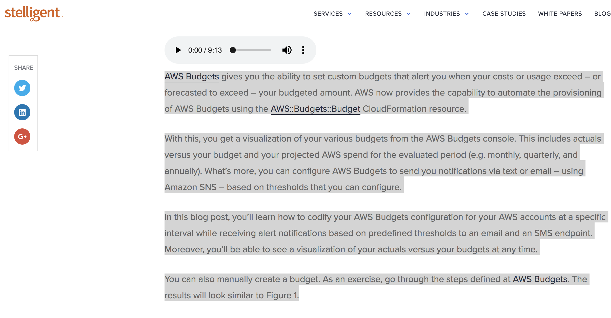
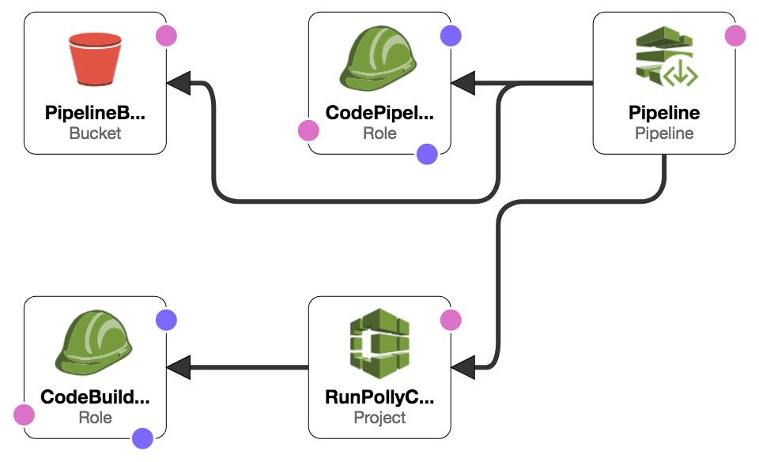

# AWS Polly
## Introduction

Using Amazon Polly to create an audio version of a blog post.

# Step 1 - Copy display text from website
Manual: Copy text from website



# Step 2 - Commit to GitHub
Commit to text file in github

```
git add blog.text
git commit -am "update blog text" && git push
```

# Step 3 - CloudFormation Template
CloudFormation of S3 bucket for storage, IAM Roles, Cloudwatch event notifications, Codebuild, Codepipeline, SNS

## CodeBuild
```
  RunPollyCommands:
    Type: AWS::CodeBuild::Project
    DependsOn: CodeBuildRole
    Properties:
      Name: !Sub ${AWS::StackName}-PollyCommands
      Description: Deploy site to S3
      ServiceRole: !GetAtt CodeBuildRole.Arn
      Artifacts:
        Type: CODEPIPELINE
      Environment:
        Type: !Ref BuildType
        ComputeType: !Ref BuildComputeType
        Image: !Sub ${BuildImage}
      Source:
        Type: CODEPIPELINE
        BuildSpec: !Sub |
          version: 0.2
          phases:
            post_build:
              commands:
                - aws --version
                - testvar=$(cat ./labs/polly/blog.txt)
                - aws polly start-speech-synthesis-task --output-format mp3 --output-s3-bucket-name delete-pmd-guardduty --output-s3-key-prefix blog --text "$testvar" --voice-id Joanna 
          artifacts:
            files:
            - '**/*'
      TimeoutInMinutes: 10
```

# Step 4 - Deployment Pipeline
Pipeline

* **Source**: Github
* **Build**: CodeBuild 

Copies file from Codepipeline input artifact to S3

Run Amazon Polly commands and store Output in S3

# Step 5 - Manual HTML Update

One Time: update Html with audio tag that points to location in S3

<audio controls>
  <source src="horse.mp3" type="audio/mpeg">
  Your browser does not support the audio tag.
</audio>

# Tips
`pip install awscli --upgrade --user` (didn't have `start-speech-synthesis-task`)

Use the same file name in S3 so that it can be used as a URL (and make it public)

Add manual approvals for manual tasks such as copying text and updating HTML with the new S3 HTTP URL

## Architecture and Implementation
###  Architecture Diagram


## CloudFormation Templates resources
  - **AWS Budget** – [AWS::Budgets::Budget](https://docs.aws.amazon.com/AWSCloudFormation/latest/UserGuide/aws-resource-budgets-budget.html) – TBD

## Costs
This section outlines cost considerations for provisioning AWS Budgets Notifications. 
- **CloudFormation** – No Additional Cost

## Deployment Steps
####  Step 1. Prepare an AWS Account
Create or login AWS account at [http://aws.amazon.com](http://aws.amazon.com) by following the instructions on the site.

####  Step 2. Launch the Stack
Click on the **Launch Stack** button below to launch the CloudFormation Stack to set up your AWS Budgets. 

**Stack Assumptions:** The pipeline stack assumes the following conditions, and may not function properly if they are not met:
1. The pipeline stack name is less than 20 characters long
2. The stack is launched in the US East (N. Virginia) Region (`us-east-1`).

*NOTE: The URL for Launch Stack is automatically generated through a pipeline in one of Stelligent's AWS accounts.*

[](https://console.aws.amazon.com/cloudformation/home?region=us-east-1#cstack=sn~sagemaker-stack|turl~https://s3.amazonaws.com/sagemaker-pipeline-src/CodePipeline/pipeline.yaml)

You can launch the same stack using the AWS CLI. Here's an example:

```
aws cloudformation create-stack --stack-name YOURSTACKNAME --template-body file:///home/ec2-user/environment/cloudformation_templates/labs/polly/pipeline.yml --parameters ParameterKey=GitHubToken,ParameterValue=GITHUBTOKEN --capabilities CAPABILITY_NAMED_IAM
```

## Parameters
Parameters | Description
---------- | -----------
GitHubUser | Your unique GitHub userid. Default is `stelligent`
GitHubRepo | GitHub Repo to pull from. Only the Name. not the URL. Default is `cloudformation_templates`
GitHubBranch | GitHub Branch. Default is `master`
GitHubToken | Available at https://github.com/settings/tokens. Should have access to the [following](https://github.com/stelligent/devops-essentials/wiki/Prerequisites#create-an-oauth-token-in-github)
BuildType | The build container type to use for building the app. Default is `LINUX_CONTAINER`
BuildComputeType | The build compute type to use for building the app. Default is `BUILD_GENERAL1_SMALL`
BuildImage | The build image to use for building the app. Default is `aws/codebuild/ubuntu-base:14.04`

####  Step 3. Test the Deployment
Go to the [AWS Polly Synthesis Tasks](https://console.aws.amazon.com/polly/home/SynthesisTasks) and verify the audio recordings have been generated. There's an S3 URL column available to download the file as well.


# Additional Resources
* [AWS::Budgets::Budget](https://docs.aws.amazon.com/AWSCloudFormation/latest/UserGuide/aws-resource-budgets-budget.html)
* [AWS Budgets](https://aws.amazon.com/aws-cost-management/aws-budgets/)

## Summary
You learned how to create an audio recording of blog post and embed a player so readers can listen to an audio rendition of your post. 

# Other Ideas
1. Manually create an Amazon S3 bucket
1. Manually create an Amazon Text-to-Speech MP3 and synthesize to Amazon S3
1. Make the MP3 public
1. Create an HTML audio tag snippet and embed in the blog post (HTML/Wordpress)
1. Create a custom CloudFormation resource
1. The Lambda in the custom CloudFormation resource will using the AWS CLI to create MP3 using Amazon Polly
1. Create a CloudFormation template that creates the S3 bucket, uses the Amazon Polly custom resource, and a CodePipeline that uses Polly every time some text is changed. 
1. @TODO Convert commands from `test.sh` to CodeBuild. Then use GitHub and have CodeBuild copy from GitHub to S3 and download it locally and use with Polly.

New Idea: Use CodeBuild to do the same thing using the AWS CLI?

Question: How to automatically upload text from Wordpress changes to S3 or a version control repo?

https://stelligent.com/feed/

https://stelligent.com/?s=TotalMonthlyBudget&feed=rss2

curl "https://stelligent.com/?s=TotalMonthlyBudget&feed=rss2"  2>/dev/null

curl "https://stelligent.com/?s=TotalMonthlyBudget"  2>/dev/null

https://docs.aws.amazon.com/cli/latest/reference/polly/synthesize-speech.html

wget https://s3.amazonaws.com/delete-pmd-guardduty/text-for-polly/text-for-polly.txt
https://docs.aws.amazon.com/polly/latest/dg/get-started-cli-exercise.html

testvar=$(cat text-for-polly.txt)
echo $testvar

aws polly start-speech-synthesis-task --output-format mp3 --voice-id Joanna --output-s3-bucket-name BUCKETNAME --text $testvar hello.mp3

Here's an example of the code snippet...